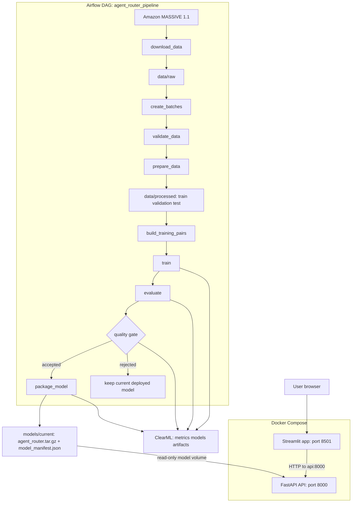

# Route-agent-PMLDL

Automated MLOps pipeline for a multilingual semantic tool router. The project
fine-tunes `intfloat/multilingual-e5-small` to map a user request either to a
registered agent tool or to the fallback `no_tool` decision.

## Architecture



Airflow schedules the same chain and processes no more than one immutable
training batch per run. ClearML stores every training, evaluation, quality-gate
and packaging experiment, including rejected candidates.

## Data and batching

The source is the pinned `AmazonScience/massive`, configuration `all_1.1`,
revision `e9957e4e8eb17fc67e3faf1a908829895653e775`. The test and validation
splits are fixed. The train split is deterministically shuffled into batches of
200 examples; each prepared dataset version records its source revision,
included batch IDs, row counts and SHA256 hashes in `data/manifests/`.

The committed demo configuration intentionally keeps each run short: one
training epoch per batch. Evaluation uses reproducible uniform samples of
2,000 examples from validation and 2,000 from test; the splits remain separate
and no evaluation sample is used for training.

## Setup: first launch

### 1. Download the project and open its folder

Open Terminal and run:

```bash
git clone https://github.com/kite121/Route-agent-PMLDL.git
cd Route-agent-PMLDL
```

If you already downloaded the repository, navigate into its folder instead:

```bash
cd path/to/Route-agent-PMLDL
```

### 2. Create the project's private Python environment

Copy and run these commands exactly:

```bash
python3.12 -m venv .venv
.venv/bin/python -m pip install --upgrade pip
make install
```

`.venv` is an isolated folder that holds this project's Python libraries. It
does not change the Python installation used by other projects. `make install`
may take a few minutes on the first run; wait until it finishes without an
error message.

### 3. Connect the project to ClearML

ClearML stores training metrics, model artifacts and the history of pipeline
runs. Create an account at [ClearML](https://app.clear.ml) if you do not have
one, then:

1. Open **Settings → Workspace** in ClearML.
2. In **API Credentials**, click **Create new credentials**.
3. Copy the access key and secret key shown once by ClearML.
4. Back in Terminal, create your private configuration file:

   ```bash
   cp .env.example .env
   ```

5. Open `.env` in any text editor and paste the two values after the equals
   signs:

   ```text
   CLEARML_API_ACCESS_KEY=paste_access_key_here
   CLEARML_API_SECRET_KEY=paste_secret_key_here
   ```

Leave the three `CLEARML_*_HOST` values unchanged. Never upload `.env` to
GitHub: it contains personal credentials and is already ignored by Git.

### 4. Check that setup is complete

Run this small safe check:

```bash
make airflow-test
```

If the command finishes without an error, setup is complete. Continue with one
of the two launch options below: run stages manually, or let Airflow run the
whole pipeline automatically.

## Run the project

Choose one way to process a new batch: manually for development, or through
Airflow for the complete automated pipeline. Do not run both flows at the same
time because both change the shared data and model state.

### Option A: run stages manually

Use this path to inspect an individual stage or develop the project. The
commands process exactly the next pending batch.

```bash
# Download or reuse the pinned source, validate and prepare the next batch.
make data

# Build training pairs, train, evaluate, apply the quality gate and package.
make train

# Start the two deployment containers with the accepted package.
make compose-up
make smoke
```

`make data` produces processed data. `make train` produces a package only when
the quality gate accepts the candidate. The package is written locally to
`models/current/` as `agent_router.tar.gz` and `model_manifest.json`.

After that, use Streamlit at `http://127.0.0.1:8501`. Generated data, models,
logs and secrets are intentionally ignored by Git.

### Run only the API and UI without retraining

Start these in separate terminals:

```bash
make api
make app
```

- FastAPI: `http://127.0.0.1:8000`
- OpenAPI: `http://127.0.0.1:8000/docs`
- Streamlit: `http://127.0.0.1:8501`

Streamlit never loads the encoder. It calls FastAPI through `API_BASE_URL`.
It first loads the current model's tool registry through `GET /tools`, displays
each tool's description and arguments, and sends the user-selected eligible
tool subset to `POST /predict`. `top_k` controls only how many ranked
candidates are displayed; it does not change the selected subset.

### Docker deployment

Docker Compose creates two containers: `api` contains FastAPI and inference
dependencies; `app` contains only Streamlit and its HTTP client. On the Compose
network, the UI calls `http://api:8000`. The model package is mounted read-only
into the API, while extraction uses an internal writable cache.

```bash
make compose-up
make smoke
```

The smoke check confirms `/health`, `/model-info`, a route to `alarm_set`, a
`no_tool` fallback, and that the served model version matches the current
manifest. Stop services with `make compose-down`.

### Option B: run the complete pipeline through Airflow

Use this path for the automated assignment scenario. Airflow itself runs on the
local machine; the API and app are the only services that must run in Docker.

```bash
make airflow
```

This one command starts the local Airflow scheduler and UI. The DAG
`agent_router_pipeline` runs every five minutes, processes at most one pending
batch, and then performs data engineering, model engineering, Docker
deployment and smoke-checking. It has `catchup=False` and
`max_active_runs=1`. If no batch is pending, the run is skipped; if the quality
gate rejects a candidate, the currently deployed model is kept.

Airflow UI is available at `http://127.0.0.1:8080` while `make airflow` is
running. Streamlit appears at `http://127.0.0.1:8501` after an accepted run.
ClearML experiments are available at `https://app.clear.ml`.

Check DAG syntax without starting a run:

```bash
make airflow-test
```

## Quality and reproducibility

The model uses `OnlineContrastiveLoss` with balanced positive and negative
pairs. The fallback threshold is selected on validation Macro F1 and applied
unchanged to the held-out test sample. The quality gate requires test
`Accuracy@1 >= 0.70` and Macro F1 no lower than the base encoder. Each model
manifest includes dataset version and hashes, tool-registry hash, Git commit,
ClearML task IDs and evaluation metrics.

## Demonstration

1. Run `make compose-up` and `make smoke`.
2. Open Streamlit and route `Set an alarm for seven tomorrow morning`.
3. Show the selected `alarm_set` tool, alternatives, similarity score and
   model version.
4. Route `Tell me a funny joke about cats` and show the `no_tool` fallback.
5. In ClearML, show the linked training, evaluation, quality-gate and package
   tasks.
6. In Airflow, show the successful scheduled `agent_router_pipeline` run and
   its three task groups.
